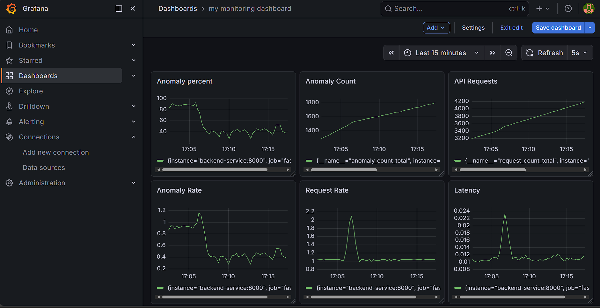
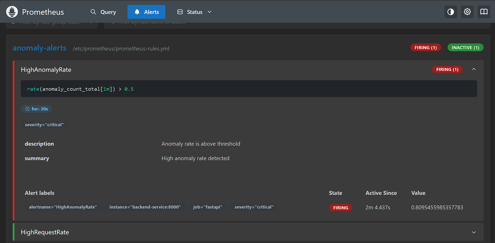
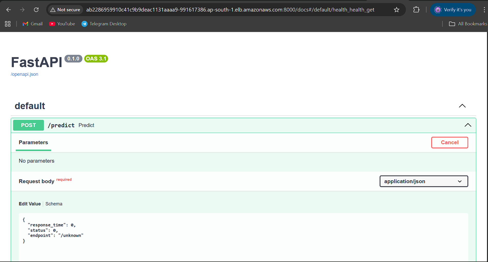
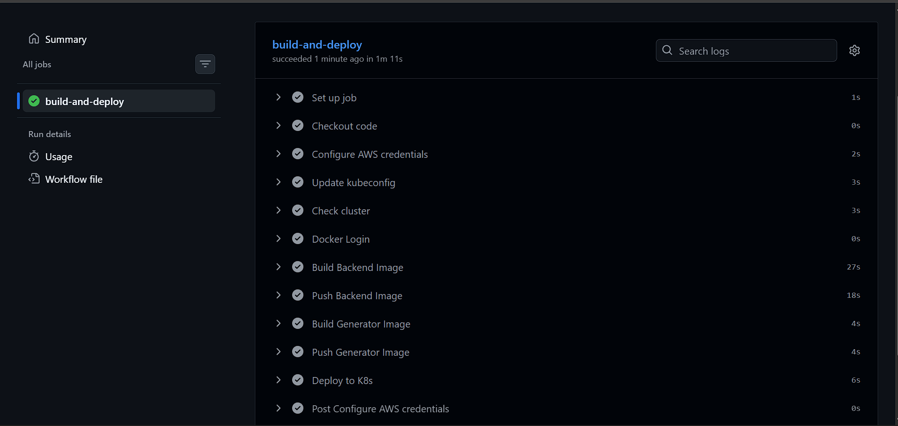
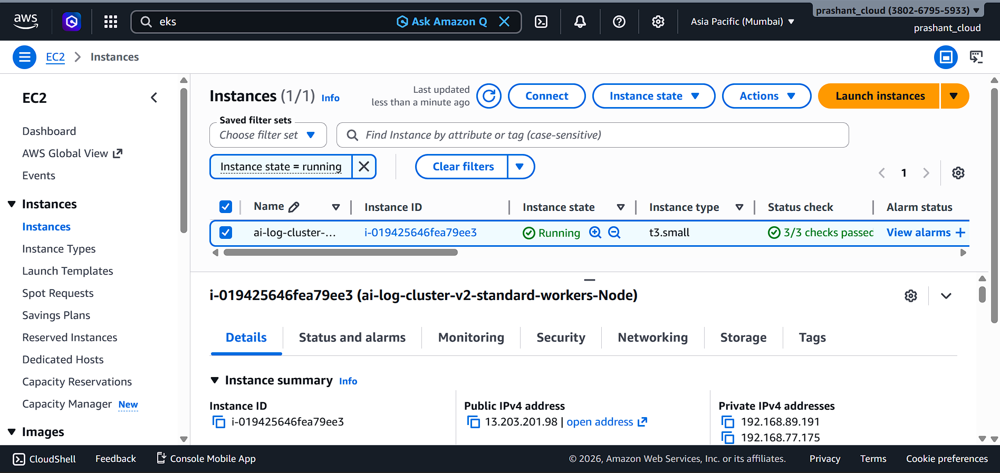
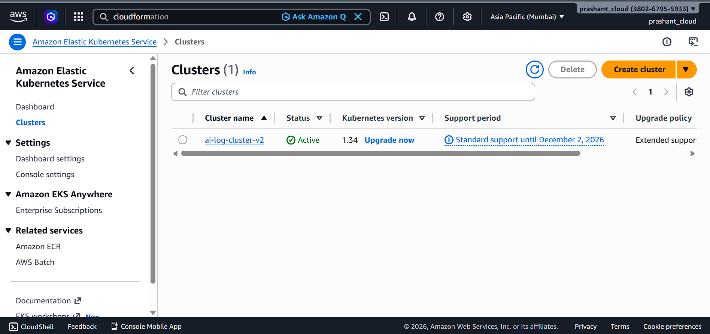
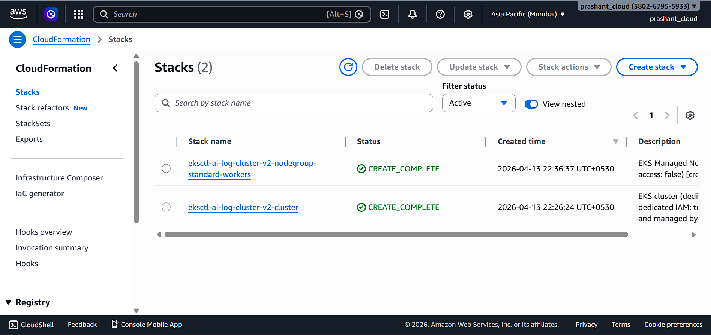
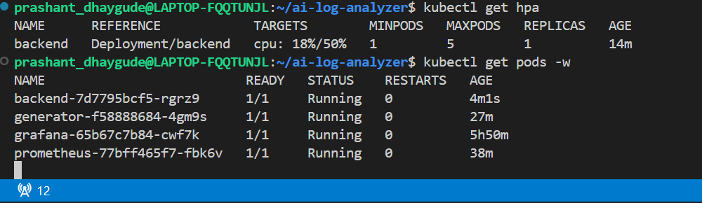

# 🚀 AI Log Analyzer — Real-Time Anomaly Detection System

---

## 📌 Overview

AI Log Analyzer is a **production-grade DevOps + Machine Learning project** that detects anomalies in real-time system logs using an ML model and visualizes system behavior through monitoring tools.

This project demonstrates a **complete end-to-end pipeline**:


---

## 🧠 Features
```
🔥 Real-time log generation
🤖 ML-based anomaly detection (Isolation Forest)
📊 Prometheus metrics collection
📈 Grafana dashboards
🚨 Alerting system
☸️ Kubernetes deployment
⚡ Auto-scaling (HPA)
🔁 CI/CD pipeline (GitHub Actions)
☁️ Cloud deployment on AWS EKS
```
---

## 🧱 System Architecture

```
Log Generator → FastAPI Backend (ML) → Prometheus → Grafana
                         ↓
                      Alerts
                         ↓
                Kubernetes (EKS)
                         ↓
                  CI/CD Pipeline
```

---

## 🤖 Machine Learning Component

### 🔹 Model Used

* **Isolation Forest (Scikit-learn)**

### 🔹 Purpose

* Detect anomalies in incoming logs based on:

  * response time
  * status codes

### 🔹 Files

📂 `log-generator/`

* `anomaly_detector.py` → ML training logic
* `realtime_detector.py` → real-time prediction
* `generator.py` → sends logs continuously

---

## 🔥 Real-Time Log Generator

* Simulates traffic every second
* Randomly generates:

  * endpoints
  * response times
  * status codes

### Behavior:

* 90% → normal traffic
* 10% → anomalies (high latency / server errors)

### Sends data to:

```
/predict endpoint (FastAPI backend)
```

---

## ⚙️ Backend (FastAPI)

### Features:

* Receives logs from generator
* Runs ML model for anomaly detection
* Returns prediction
* Exposes Prometheus metrics

### Endpoints:

```
POST /predict   → anomaly detection
GET  /metrics   → Prometheus metrics
```

---

## 📊 Metrics (Prometheus)

The backend exposes:

* `request_count_total` → total requests
* `anomaly_count_total` → detected anomalies
* `request_processing_seconds` → latency

---

## 📈 Grafana Dashboards

You created visual dashboards with:

* 📊 Request Count
* 🚨 Anomaly Count
* ⚡ Request Rate
* ⏱ Latency

✔ Real-time updating graphs
✔ Clean visualization for demo/interview

---

## 🚨 Alerting System

Prometheus alert rules:

* High anomaly spike
* High request rate

✔ Alerts successfully firing
✔ Production-style monitoring achieved

---

## ☸️ Kubernetes Deployment (Minikube → EKS)

### Deployed Components:

* Backend (Deployment + Service)
* Generator (Deployment)
* Prometheus (ConfigMap + Deployment + Service)
* Grafana (Deployment + Service)

---


## ⚡ Auto Scaling (HPA)

Enabled Horizontal Pod Autoscaler:

```
kubectl autoscale deployment backend \
  --cpu-percent=50 \
  --min=1 \
  --max=5
```

✔ Backend scales automatically under load

---

## 🔁 CI/CD Pipeline (GitHub Actions)

Pipeline does:

✔ Build Docker images
✔ Push to Docker Hub
✔ Connect to AWS EKS
✔ Deploy using Kubernetes

---

## ☁️ AWS EKS Deployment

* IAM user configured
* AWS CLI setup
* EKS cluster created
* Application deployed successfully

---

## 📂 Project Structure

```
ai-log-analyzer/
├── backend/
├── log-generator/
│   ├── generator.py
│   ├── anomaly_detector.py
│   ├── realtime_detector.py
├── k8s/
│   ├── backend-deployment.yml
│   ├── backend-service.yml
│   ├── generator-deployment.yml
│   └── monitoring/
│       ├── prometheus-config.yml
│       ├── prometheus-deployment.yml
│       └── prometheus-service.yml
├── monitoring/
│   └── prometheus.yml
├── grafana/
├── docker/
└── .github/workflows/
```

---

## 🧪 Run Locally (Optional)

```
docker-compose up --build
```

---

## 🚀 Deploy on Kubernetes

```
kubectl apply -f k8s/
```

---

## 🏁 Final Status

✅ Real-time system working
✅ Monitoring + dashboards
✅ Alerts firing
✅ Auto scaling enabled
✅ CI/CD working
✅ Deployed on AWS

---


## 📸 Project Screenshots

---

### 📊 Grafana Dashboard (Real-Time Metrics)



---

### 🚨 Prometheus Alerts (Anomaly Detection)



---

### 🔍 Prometheus Query UI


---

### ⚡ FastAPI Running on AWS EKS



---

### 🔁 CI/CD Pipeline (GitHub Actions)



---

### ☁️ AWS EC2 Instance



---

### ☸️ AWS EKS Cluster Running



---

### 🧱 CloudFormation Stacks



---

### ⚡ Kubernetes HPA (Auto Scaling)



---

### ❤️ Service Health (Backend Up)


